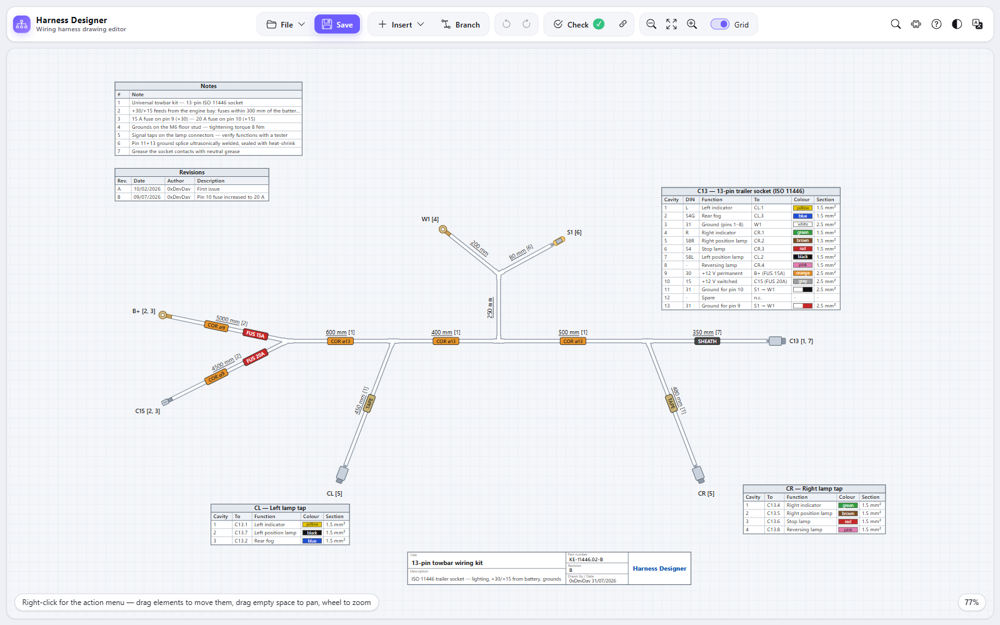

<div align="center">

# 🔌 Harness Designer

**Draw automotive wiring harnesses the way the workshop expects them**

Formboard drawings with double-line bundles, connectors, cavity tables, consistency checks and wire lists

[](https://0xdevdav.github.io/harness-designer/)
[](LICENSE)
[](tsconfig.json)
[](https://vite.dev)
[](package.json)
[](tests)

[**▶ Try it now**](https://0xdevdav.github.io/harness-designer/) • [Features](#-features) • [Screenshots](#-screenshots) • [Quick start](#-quick-start) • [How it works](#-how-it-works) • [Plugins](#-plugins) • [Deploy](#-deploy)

**🇬🇧 English** · [🇮🇹 Italiano](README.it.md)

</div>

---

A **static site**: no backend, no account, no sign-up, nothing leaving the browser. Your drawing lives on
your own computer and is archived as a `.json` file you own.

## ✨ Features

| Feature                  | Description                                                                                                         |
| ------------------------ | ------------------------------------------------------------------------------------------------------------------- |
| 🎨 **Formboard drawing** | Double-line bundles, junction boots, termination symbols, inline labels for fuses, conduit and tape                 |
| 📋 **Cavity tables**     | Pin-outs edited straight on the sheet, tied to their connector                                                      |
| 🔗 **Automatic linking** | Fill in a destination and the matching cavity at the far end fills itself, colour and section included              |
| ✅ **Consistency check** | Mismatched cross-references, missing cavities, one-way links and disagreeing wire properties, each clickable        |
| ⚡ **Two-ends rule**     | The same colour across three or more connectors is flagged as the wiring mistake it is, with black exempt as ground |
| 📊 **Wire list**         | Generated from the tables, mirrored pairs collapsed, exportable as CSV                                              |
| 🌍 **Bilingual**         | Italian and English, switchable at runtime, colour names included                                                   |
| 🧩 **Plugins**           | Commands, validation rules, exporters, connector symbols and colour names, without recompiling                      |
| 🎯 **Command palette**   | `Ctrl+K` for every action and its shortcut                                                                          |
| 🌗 **Light and dark**    | The sheet stays light in both, because that is what gets printed                                                    |
| 📱 **Touch ready**       | Pinch, drag and an offcanvas menu on tablets and phones                                                             |
| 📦 **Single file**       | One HTML file that opens on a double click, with no server at all                                                   |

## 📸 Screenshots

<div align="center">

<p><em>The sample drawing that ships with it: a 13-pin ISO 11446 towbar kit, with cavity tables, notes, revisions and title block</em></p>
</div>

## 🚀 Quick start

Node 20 or newer, and only to build: what comes out is static.

```bash
git clone https://github.com/0xDevDav/harness-designer.git
cd harness-designer
npm install
npm run dev        # http://localhost:5173
```

| Command                    | What it does                                    |
| -------------------------- | ----------------------------------------------- |
| `npm run dev`              | Development server with hot reload              |
| `npm run build`            | Type check, then the static site in `dist/`     |
| `npm run build:standalone` | One self-contained `dist-standalone/index.html` |
| `npm test`                 | Vitest, 173 tests over the core                 |
| `npm run typecheck`        | `tsc --noEmit`                                  |
| `npm run lint`             | ESLint                                          |

## 🎮 How it works

**Select and move is always on.** Click to select, drag to move nodes, tables and labels; drag empty space
to pan, wheel to zoom. The same gestures work with fingers.

| Action              | How                                                           |
| ------------------- | ------------------------------------------------------------- |
| Draw a branch       | Right-click empty space → _Start a branch here_, or press `B` |
| Edit anything       | Double-click it on the sheet                                  |
| Add an inline label | Right-click a branch → _Add inline label here_                |
| Fill a pin-out      | Double-click a cell, `Tab` to the next one                    |
| Pick a wire colour  | Double-click the colour cell: IEC 60757 and DIN 47002 palette |
| Undo                | `Ctrl+Z`, and every change is one step                        |

There is **no sidebar**: properties are edited where they are drawn, and everything else lives in the
right-click menu.

### The destination of a wire

Written either way, both understood:

```
To = "C3.3"                a single column
To = "C3"  +  PIN = "3"    split across two
```

Fill one end in and the other fills itself. If the target cavity already points somewhere else the
conflict is reported and nothing is overwritten: silently losing a link is worse than not creating one.

## 🧩 Plugins

A plugin is an ES module exporting an object with `activate(api)`. No build step: write it, install it, it
runs.

```js
export default {
  id: "acme.example",
  name: "Example",
  version: "1.0.0",
  activate(api) {
    api.i18n.add("en", { "plugin.acme.example.hello": "Say hello" });
    api.commands.register({
      id: "acme.example.hello",
      titleKey: "plugin.acme.example.hello",
      run: () => api.ui.toast("Hello!"),
    });
  },
};
```

Two examples ship under `public/plugins/`: branch length totals grouped by covering, and a round DIN
connector symbol with the DIN 47002 colour codes.

> ⚠️ Plugins run with the same permissions as the page. External ones are only imported over `https:`.
> See [SECURITY.md](SECURITY.md).

Full API: **[docs/PLUGINS.md](docs/PLUGINS.md)**

## 📦 Deploy

Upload the contents of `dist/` to any web host. `base: "./"` means it works from the domain root or from a
subfolder, with no configuration.

For the single-file build, `dist-standalone/index.html` is the whole program: hand it over on a USB stick
and it opens with a double click.

Step by step: **[docs/DEPLOY.md](docs/DEPLOY.md)**

## 🏗️ Project structure

```
harness-designer/
├── src/
│   ├── main.ts           # startup: services, context, listeners
│   ├── app/context.ts    # the service contracts, read this first
│   ├── core/             # pure logic, no DOM: this is what the tests cover
│   ├── render/           # SVG drawing
│   ├── ui/               # interface: bar, menus, panels, in-place editing
│   ├── io/               # storage, files, exporters
│   ├── plugins/          # public API and host
│   └── i18n/             # dictionaries
├── public/plugins/       # example plugins, loaded at runtime
├── tests/                # Vitest over the core
└── docs/                 # architecture, deploy, plugin API
```

Design notes and the reasoning behind the decisions: **[docs/ARCHITECTURE.md](docs/ARCHITECTURE.md)**

## 📄 Licence

MIT: see **[LICENSE](LICENSE)**.

To contribute: **[CONTRIBUTING.md](CONTRIBUTING.md)**.

## 🙏 Credits

Interface icons from [Bootstrap Icons](https://icons.getbootstrap.com/) (MIT). The paths are embedded in
the code: nothing is fetched from the network, so it works offline and as a single file.
